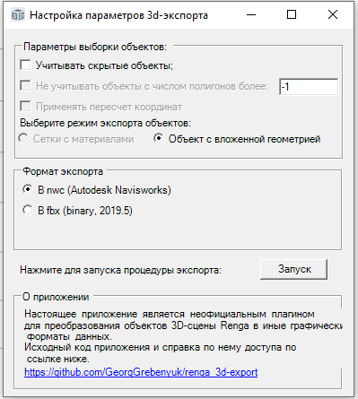
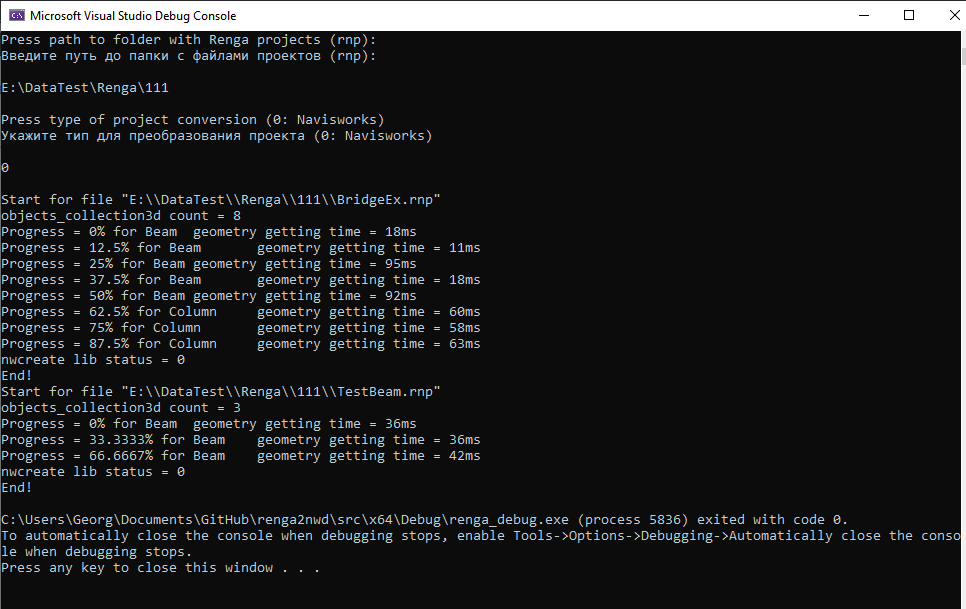

# renga_3d-export
[In progress now!] Plugin to convert renga's model to 3D-data formats (now - only for Autodesk Navisworks - NWC)

## External dependencies (Внешние зависимости):
1. Renga SDK (all header's file (in "Renga_imprort.h") and RengaCOMAPI.tlb). Download SDK [here](https://rengabim.com/sdk/);
2. Autodesk Navisworks SDK, nwcreate-lib; download SDK [here](https://www.autodesk.com/developer-network/platform-technologies/navisworks). I am using 2022 version;

## About using (Об использовании):
Настоящее приложение работает в двух режимах: (в качестве встраиваемого плагина в систему Renga - ПОКА НЕ РАБОТАЕТ) и как внешнее независимое консольное приложение, запускающее процесс Renga  работающее с ним через COM.
Видеоинструкция приведена ниже с моего блога:

[запустить видео](https://zen.yandex.ru/video/watch/627163b93f22317b414fddbe)

Для использования, загружайте последнюю скомпилированную версию утилиты [здесь](https://github.com/GeorgGrebenyuk/renga_3d-export/releases) в виде архива с названием вида "export_data_plugin_ver-\*\*.zip". Внутри запускайте файл "renga_debug.exe" и последовательно введите файловый путь до папки с проектом, и далее тип экспорта (на текущий момент доступен только экспорт в Navisworks - файл NWC с кодом "0").

После ввода информации фоново запустится процесс Renga, откроется проект из указанной папки и начнется процедура экспорта его содержимого в формат NWC. В консоли будет приведен текущий прогресс в %, какой объект обрабатывается.

Стоит отметить, скорость обработки существенно понижается при наличии в проекте гладких объектов (или объектов с кривыми) - труб, лепнин и пр семейств. Ориентировочное время экспорта до 5 мин. В результате в одном каталоге с файлом появится файл NWC с дополненным названием (для множественного экспорта). Это сугугбо удобства отладки. В поздних версиях будет убрано.

## О поддержке объектов
- экспорт идет только объектов из 3D-представления, для которых есть методы получения геометрии;
- не для всех категорий объектов реализована точная передача цвета ввиду сложности описывающих интерфейсов. НЕ реализована логика назначения цвета по стилю (например, для трасс сетей) а также для объектов входящих в Сборки. Для многослойных материалов назначается первый в списке цвет. Для элементов, имеюших несколько GridType пока назначается статичный цвет. Для GridType::Glass назначается коэффициент прозрачности = 0.6;
- пока не реализована поддержка расчетных свойств и параметрических свойств;

## О поддерживаемых форматах экспорта
### Autodesk Navisworks
Формирует файл NWC с сортировкой объектов по уровням (пока без дополнительных валоженных типов).

## Планы на будущее
- SketchUp, \*.skp;
- GMSH, \*.msh;
- CityGML, \*.gml;
- Autodesk(?) FBX, \*.fbx;
- Rhino, \*.3dm;
- Chronos group GLTF, \*.gltf/\*.glb;
